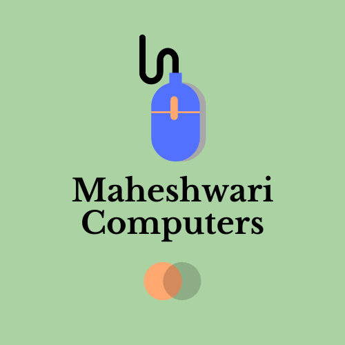

<h1 align="center">💻 Maheshwari Computers</h1>
<p align="center">
  <em>Kanpur’s trusted one-stop destination for computer sales, repairs, accessories, and IT solutions.</em>
</p>

<p align="center">
  
</p>

---

## 🌟 Overview
Maheshwari Computers is a responsive website designed to showcase IT services, hardware sales, and customer support.  
It highlights **25+ years of trusted service in Kanpur**, offering everything from chip-level repairs to creative poster and website designing.

This project demonstrates:
- Clean, modern **HTML5 structure**
- Responsive **CSS3 design**
- Interactive **JavaScript burger menu**
- Customer-centric layout with testimonials and contact form

---

## ✨ Features
- 🔧 **Responsive Navbar** – Right-aligned on desktop, left-aligned slide-in on mobile
- 🎬 **Hero Section** – Full-screen background with typewriter effect
- 📊 **Services Grid** – Hardware repair, software support, poster & website designing
- 💬 **Testimonials** – Real client feedback in a clean card layout
- 📍 **Contact Section** – Location, phone, email, and working contact form
- 🖼️ **Modern Design** – Smooth hover effects, shadows, and parallax hero background


---

## 🚀 Getting Started

<details>
<summary>📥 Clone the repository</summary>

```bash
git clone https://github.com/riddhi348/maheshwari-computers.git
